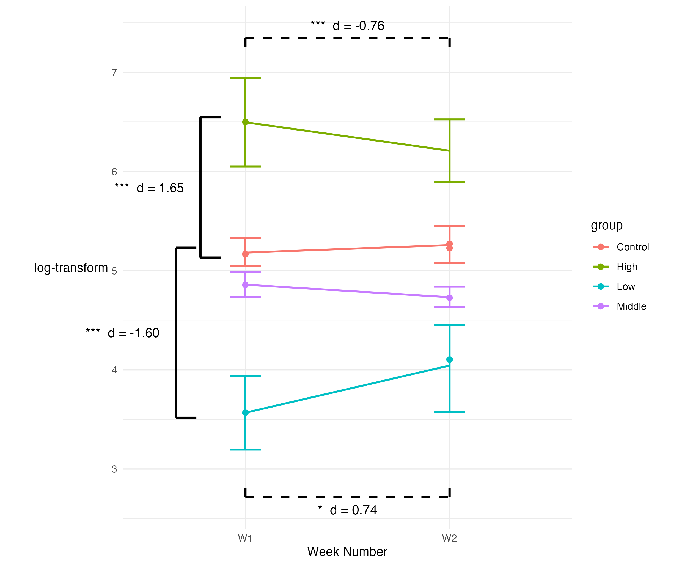

# errorbars

Currently in progress -- 

We're working on figuring out a system compatible with ggplot2 for annotating
figures with labelled brackets with a particular interest in annotating
significance results.

